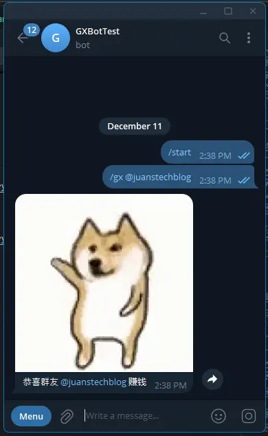
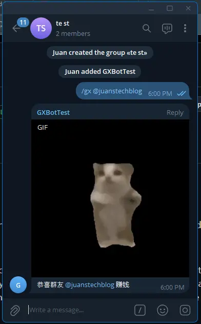

I want to create a bot that can congratulate other Telegram group members when they make a profit from crypto investments **(Please do your own research before making any investments)**. 

I keep the Telegram bot's function simple. Group members can instruct the bot using command( **/gx** ) and mention( **@** ) a user. The bot will then reply a prefixed congratulatory message and attach with a random GIF. 

## How to Create a Telegram Bot?
> I don't really know.

I once create a Telegram bot for a school coursework. I wrote the backend program in python and ran it on my laptop. 

Now, the Telegram group members are from different countries and time zones, so the bot should be available for 24/7. I don't want to keep my computer running all the time, so I'm considering different approach. "Serverless" came to my mind—it allows the Telegram bot code to run on the cloud 24/7 and on demand. 

My plan is straightforward. I will use JavaScript to write the code, Cloudflare Workers (a serverless service) to run the code, and Cloudflare Workers KV(a cloud data storage) to store some GIF URLs.

Let's begin. 

## Prerequisite 
- A Telegram account.
- A Cloudflare account.

## Create a Telegram Bot.
To create a Telegram bot, we need to talk to the BotFather.
1. Go to [**BotFather**](https://t.me/BotFather) , type **`/newbot`**, or click Menu and select **`/newbot`**.
2. Enter your bot's **name**(e.g., GX Bot).
3. Enter your bot's **username**(e.g., gx-box).
4. BotFather will then provide you with an **HTTP API token**.

The **HTTP API token** is important and will be used to control the bot we just created.

## Setup Telegram Bot Command and Group Privacy.
Next, we pre-define a command in our Telegram bot to make it easier for users. 
1. Type `/mybot` and select `our bot`(e.g., gx-bot).
2. Choose `Edit Bot` and then `Edit Commands`.
3. Enter the command following the format provided by BotFather's prompt. (e.g., gx - 加 @ 用户 Bot 就会帮你恭喜群友).

Also, disable the Telegram bot's group privacy settings to allow all message flows to the bot backend without requiring group admin right.
1. Type `/mybot` and select `our bot` (e.g., gx-bot).
2. Select `Bot Settings` and `Group Privacy`.
3. Click `Turn off`.

## Create a Cloudflare Workers.
1. Log in to [**Cloudflare**](https://dash.cloudflare.com/login).
2. Go to **Workers & Pages** in the left side menu and click the **Overview**.
3. Click the **Create**, then select **Create Worker** under the **Workers** tab.
4. Enter a **name**(e.g., gx-bot-worker) for the worker and click **Deploy**.
5. Once it's done, click the **Continue to Project** button.

The worker is now ready to serve. It's just waiting for us to provide the code to run. We will click the **Edit Code** button later to paste the code. Before that, we will need to set up Cloudflare Workers KV to store our GIF URLs.

## Create and Set Up Cloudflare Workers KV.
We will use Cloudflare Workers KV to store the GIF URLs, which will be included in the Telegram bot response. 
1. Click the **down arrow** next to **Workers & Pages** on the left, and then click the **KV**.
2. Click **Create a Namespace**, enter a **Namespace Name**(e.g., kv-gifs), and click **Add**. 
3. Afterward, the new Namespace will be added to the table blow. Click **View** in the row of the Namespace we just created.
4. Go to the **KV Pairs** tab, and enter the key and value as shown in the table below. 

| Key    | Value                                                                                                                         |
| ------ | ----------------------------------------------------------------------------------------------------------------------------- |
| `gifs` | ```["https://media1.tenor.com/m/-ZQ-I0N9dRwAAAAC/dog-cute-dog.gif","https://media.tenor.com/WIMffkKhJC0AAAAi/pig-dog.gif"]``` |
>You can always replace the values with your own GIF URLs.

>Cloudflare KV stores data in key-value pairs. Our **value** will be the **URLs in JSON array** format, and we will use **gifts** as the **key** to retrieve it. 

5. Click **Add entry** to save.

## Binding Cloudflare Workers KV and Variables/Secrets in Cloudflare Workers.

To use Cloudflare KV in the worker, we need to bind the services together first. Additionally, we will bind our **HTTP API token** and two secret variables.  
1. Click the **down arrow** next to **Workers & Pages** at the left and select **Overview**.
2. Click the **name of the worker**(e.g., gx-bot-worker, from the previous example) we just created earlier.
3. Go to the **Settings** tab.
### Binding Cloudflare KV
1. Under **Bindings**, click the **+ Add**. 
2. Click **KV namespace**(e.g., kv-gifs, from the previous example).
3. Enter a **Variable name**(e.g., GIFS), choose the **KV namespace** we just created, and click **Deploy**.

### Add Variables and Secrets
We will create two variables according to the table below:


| Variable Name  | Value                                                |
| -------------- | ---------------------------------------------------- |
| ENV_BOT_TOKEN  | <**HTTP API token from BotFather**>                  |
| ENV_BOT_SECRET | <**A Random combination of A-Z, a-z, 0-9, _ and -**> |
> `ENV_BOT_TOKEN` will store our HTTP API token. For `ENV_BOT_SECRET`, we need to create a value as a secret key to verify each Telegram updates. 

1. Under **Variables and Secrets**, click **+Add**.
2. The **Type** can remain as **text** or be changed to **secret** to encrypt the text.
3. Enter the **Variable Name** and **Value** according to the table above.
4. Click **Deploy**.

## Coding 
I will fork the code from [telegram-bot-cloudflare](https://github.com/cvzi/telegram-bot-cloudflare) by [cvzi](https://github.com/cvzi) and then make some modifications to fit our case. 

First, we will declare some variables and constants. 
```js
let TOKEN; // Get it from @BotFather https://core.telegram.org/bots#6-botfather
let SECRET; // A-Z, a-z, 0-9, _ and -
let ENV_VAL; // Enviroment 

const WEBHOOK = '/endpoint';
const BOT_COM = 'bot_command';
const GX_COM = '/gx';
const MENTION = 'mention';
const TXT_MENTION = 'text_mention';
```

<br>

We will create an entry point for the worker to receive and process requests from the Telegram bot API.
```js
export default {
  async fetch(request, env) {
    ENV_VAL = env;
    TOKEN = env.ENV_BOT_TOKEN;
    SECRET = env.ENV_BOT_SECRET;
    return await route(request);
  },
};
```
The Workers runtime will inject the KV bindings, variables and secrets in the `env`. We assign them to our variables accordingly and pass the `request` to the `route` function.

<br>

The `route` function will direct the `request` to be processed with `handleWebhook` or set up our worker using the `registerWebhook` and `unRegisterWebhook` functions.
```js
/**
 * Wait for requests to the worker
 */
async function route (request) {
  const url = new URL(request.url)
  
  if (url.pathname === WEBHOOK) {
    return await handleWebhook(request);
  } else if (url.pathname === '/registerWebhook') {
    return await registerWebhook(request, url, WEBHOOK, SECRET);
  } else if (url.pathname === '/unRegisterWebhook') {
    return await unRegisterWebhook(request);
  } else {
    return await new Response('No handler for this request');
  }
}
```

<br>

The `registerWebhook` function will notify our endpoint URL and  `ENV_BOT_SECRET` to the Telegram Bot API for receiving new updates. Obviously, the `unRegisterWebhook` function undoes this.
```js
/**
 * Set webhook to this worker's url
 * https://core.telegram.org/bots/api#setwebhook
 */
async function registerWebhook (request, requestUrl, suffix, secret) {
  // https://core.telegram.org/bots/api#setwebhook
  const webhookUrl = `${requestUrl.protocol}//${requestUrl.hostname}${suffix}`
  const r = await (await fetch(apiUrl('setWebhook', { url: webhookUrl, secret_token: secret }))).json()
  return new Response('ok' in r && r.ok ? 'Ok' : JSON.stringify(r, null, 2))
}

/**
 * Remove webhook
 * https://core.telegram.org/bots/api#setwebhook
 */
async function unRegisterWebhook (request) {
  const r = await (await fetch(apiUrl('setWebhook', { url: '' }))).json()
  return new Response('ok' in r && r.ok ? 'Ok' : JSON.stringify(r, null, 2))
}
```
<br>

The `handleWebhook` function will check the incoming request's secret token from Telegram Bot API against our `ENV_BOT_SECRET`. After that, it will convert `request` to JSON format and forward it to `onUpdate` function.
```js
/**
 * Handle requests to WEBHOOK
 * https://core.telegram.org/bots/api#update
 */
async function handleWebhook (request) {

  // Check secret
  if (request.headers.get('X-Telegram-Bot-Api-Secret-Token') !== SECRET) {
    return new Response('Unauthorized', { status: 403 })
  }

  // Read request body synchronously
  const update = await request.json()
  
  // Deal with response asynchronously
  await onUpdate(update);
  
  return new Response('Ok')

}
```
<br>

The `onUpdate` function checks whether the `message` object exists in the `update`. if it does, the function forwards the `message` to `onMessage`.

```js
/**
 * Handle incoming Update
 * https://core.telegram.org/bots/api#update
 */
async function onUpdate (update) {
  if ('message' in update) {
    await onMessage(update.message)
  }
}
```

<br>

The `onMessage` function will perform several checks:
1. Check whether the `entities` object exists in the message. 
2. Check whether one of the `entities`'s types is  `BOT_COM`.
3. Find the `mentionedUser` in the `entities`through the `entities`'s type of `MENTION` or `TXT_MENTION`.
4. Check whether the command is valid. 
If all the checks pass, extract the username, substitute it into a template string, and pass it to the  `sendAnimationAndText` function. 
```js
/**
 * Handle incoming Message
 * https://core.telegram.org/bots/api#message
 */
function onMessage (message) {

  if (!('entities' in message)) {
    return;
  }
  
  let validComm = false;
  let hasBotComm = message.entities.some(entity => entity.type === BOT_COM);
  let mentionedUser = message.entities.find(entity => entity.type === MENTION ||  entity.type === TXT_MENTION);

  if (hasBotComm) {
    validComm = message.text.startsWith(GX_COM)
  }

  if (hasBotComm && validComm && mentionedUser) {
    let text = message.text;
    let mentionedUsername = text.slice(mentionedUser.offset, mentionedUser.offset + mentionedUser.length);
    let response = `恭喜群友 ${mentionedUsername} 赚钱`;
    return sendAnimationAndText(message.chat.id, response);
  }
  return;
}
```

<br>

The `sendAnimationAndText` function will retrieve the list of gifs from KV and randomly pick a URL from it. Afterwards, it will pass all the parameters to `apiUrl` to form a query string and send it as a response to the Telegram Bot API.  
```js
/**
 * Send plain text message
 * https://core.telegram.org/bots/api#sendmessage
 */
async function sendAnimationAndText (chatId, text) {
  let gifs = JSON.parse(await ENV_VAL.GIFS.get("gifs"));

  let randomGif = gifs[Math.floor(Math.random() * gifs.length)];

  return (await fetch(apiUrl('sendAnimation', {
    chat_id: chatId,
    animation: randomGif,
    caption: text
  }))).json()
}
```
<br>

The `apiUrl` is a utility function that converts the passed-in parameters to query strings. 
```js
/**
 * Return url to telegram api, optionally with parameters added
 */
function apiUrl (methodName, params = null) {
  let query = ''
  if (params) {
    query = '?' + new URLSearchParams(params).toString()
  }
  return `https://api.telegram.org/bot${TOKEN}/${methodName}${query}`
}
```

### Full code

```js
/**
 * Original source code: https://github.com/cvzi/telegram-bot-cloudflare
 * with some modification by YJCHOO
 */

let TOKEN; // Get it from @BotFather https://core.telegram.org/bots#6-botfather
let SECRET; // A-Z, a-z, 0-9, _ and -
let ENV_VAL;

const WEBHOOK = '/endpoint';
const BOT_COM = 'bot_command';
const GX_COM = '/gx';
const MENTION = 'mention';
const TXT_MENTION = 'text_mention';

export default {
  async fetch(request, env) {
    ENV_VAL = env;
    TOKEN = env.ENV_BOT_TOKEN;
    SECRET = env.ENV_BOT_SECRET;

    return await route(request);
  },
};

/**
 * Wait for requests to the worker
 */
async function route (request) {
  const url = new URL(request.url);

  if (url.pathname === WEBHOOK) {
    return await handleWebhook(request);
  } else if (url.pathname === '/registerWebhook') {
    return await registerWebhook(request, url, WEBHOOK, SECRET);
  } else if (url.pathname === '/unRegisterWebhook') {
    return await unRegisterWebhook(request);
  } else {
    return await new Response('No handler for this request');
  }
}

/**
 * Handle requests to WEBHOOK
 * https://core.telegram.org/bots/api#update
 */
async function handleWebhook (request) {
  // Check secret
  if (request.headers.get('X-Telegram-Bot-Api-Secret-Token') !== SECRET) {
    return new Response('Unauthorized', { status: 403 });
  }
  
  // Read request body synchronously
  const update = await request.json();
  
  // Deal with response asynchronously
  await onUpdate(update);
  
  return new Response('Ok');
}

/**
 * Handle incoming Update
 * https://core.telegram.org/bots/api#update
 */
async function onUpdate (update) {
  if ('message' in update) {
    await onMessage(update.message);
  }
}

/**
 * Handle incoming Message
 * https://core.telegram.org/bots/api#message
 */
function onMessage (message) {

  if (!('entities' in message)) {
    return;
  }
  
  let validComm = false;
  let hasBotComm = message.entities.some(entity => entity.type === BOT_COM);
  let mentionedUser = message.entities.find(entity => entity.type === MENTION ||  entity.type === TXT_MENTION);

  if (hasBotComm) {
    validComm = message.text.startsWith(GX_COM);
  }
  
  if (hasBotComm && validComm && mentionedUser) {
    let text = message.text;
    let mentionedUsername = text.slice(mentionedUser.offset, mentionedUser.offset + mentionedUser.length);
    let response = `恭喜群友 ${mentionedUsername} 赚钱`;
    
    return sendAnimationAndText(message.chat.id, response);
  }
  return;
}

/**
 * Send plain text message
 * https://core.telegram.org/bots/api#sendmessage
 */
async function sendAnimationAndText (chatId, text) {
  let gifs = JSON.parse(await ENV_VAL.GIFS.get("gifs"));
  let randomGif = gifs[Math.floor(Math.random() * gifs.length)];

  return (await fetch(apiUrl('sendAnimation', {
    chat_id: chatId,
    animation: randomGif,
    caption: text
  }))).json()
}

/**
 * Set webhook to this worker's url
 * https://core.telegram.org/bots/api#setwebhook
 */
async function registerWebhook (request, requestUrl, suffix, secret) {
  // https://core.telegram.org/bots/api#setwebhook
  const webhookUrl = `${requestUrl.protocol}//${requestUrl.hostname}${suffix}`;
  const r = await (await fetch(apiUrl('setWebhook', { url: webhookUrl, secret_token: secret }))).json();
  return new Response('ok' in r && r.ok ? 'Ok' : JSON.stringify(r, null, 2));
}

/**
 * Remove webhook
 * https://core.telegram.org/bots/api#setwebhook
 */
async function unRegisterWebhook (request) {
  const r = await (await fetch(apiUrl('setWebhook', { url: '' }))).json();

  return new Response('ok' in r && r.ok ? 'Ok' : JSON.stringify(r, null, 2));
}

/**
 * Return url to telegram api, optionally with parameters added
 */
function apiUrl (methodName, params = null) {
  let query = '';
  
  if (params) {
    query = '?' + new URLSearchParams(params).toString();
  }
  return `https://api.telegram.org/bot${TOKEN}/${methodName}${query}`;
}
```

## Testing

Now, it's time to test the bot.

Search our bot, click `start` and type command.



Add the bot to our group chat and test it.



