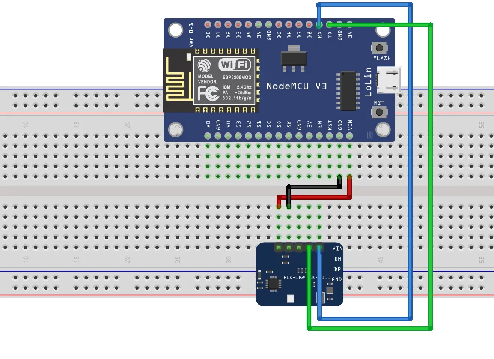
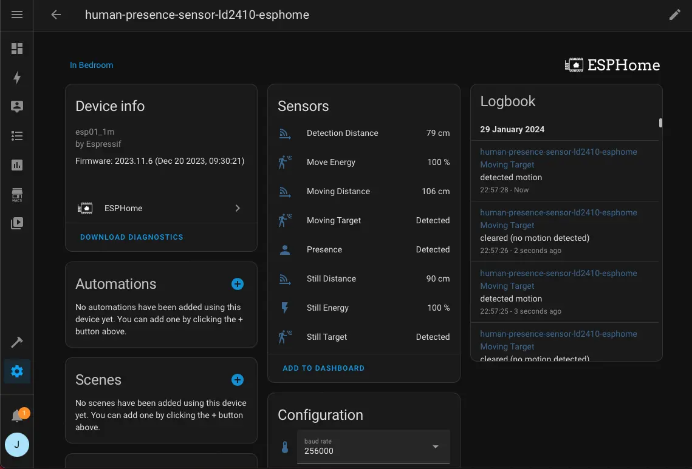

The photo above is my cheap human presence sensor with ESP8266 and LD2410C mmWave radar sensor. It costs about RM 27—ESP8266-RM 9.90 and LD2410C-RM 17.61. 

This is my first time using ESPHome and LD2410. The LD2410C mmWave radio sensor module comes with Bluetooth connectivity, and Home Assistant has an integration for this sensor module. We can power the LD2410C and directly integrate the sensor module into Home Assistant via Bluetooth. 

Somehow, the Bluetooth connection between the Home Assistant and LD2410C is unstable and breaks every few minutes. Therefore, I use an ESP8266 hook with LD2410C, run ESPHome, and integrate it into Home Assistant via Wi-Fi.

Let's build it.

## Parts Required
- ESP8266 development board - Also, any ESP32 development.
- HLK-LD2410C mmWave Radar Sensor Module - Any LD2410 variant.
- A few jumper wires.
- USB Cable.
- Breadboard - if necessary.
- Power Adapter - if necessary.

## Flash ESPHome into ESP8266
We will use the ESPHome's install ready-made project method to flash the firmware into our ESP8266 development board and adopt it in the ESPHome Dashboard. This method only works with Chrome and Microsoft Edge browsers. Also, it may need the development board's USB driver.

1. Connect ESP8266 to the computer via a USB cable.
2. Log on to [ESPHome's web page](https://esphome.io/projects/).
3. Select __*Empty ESPHome device*__ under the __*I want to create a:*__ section, pick __*ESP32/ESP8266*__ under __*the manufacturer of the device you want to set up*__ section, and click __*CONNECT*__ button.
4. Select the corresponding USB serial port in the pop-out window.
5. Click the __*INSTALL ESPHOME WEB*__.
6. Configure the Wi-Fi.

After, we can leave the ESP8266 alone, keep it powered, and upload a new configuration(yaml) through wireless in the ESPHome Dashboard later.

## Set up ESPHome Dashboard using Docker Compose
Next, We run the ESPHome Dashboard in a Docker container using Docker Compose.

We can create a new or modify existing docker-compose.yaml as below:
> The script below is from the official documentation.
```yaml
version: '3'
services:
  esphome:
    container_name: esphome
    image: ghcr.io/esphome/esphome
    volumes:
      - /path/to/esphome/config:/config
      - /etc/localtime:/etc/localtime:ro
    restart: always
    privileged: true
    network_mode: host
    environment:
      - USERNAME=ChangeHere
      - PASSWORD=ChangeHere
```
> Remember to change the `USERNAME` and `PASSWORD` variables in the `environment`.

We can execute the command below to start the container.
```shell
$ docker compose up -d
```
Once the ESPHome Dashboard is started, we can log on to the web page.

```
http://<your ip address>:6052/
```

## Adopt ESP8266 in ESPhome Dashboard
After logging in to the ESPHome Dashboard, the newly flashed firmware ESP8266 should appear in the dashboard. We click the __*ADOPT*__ button to adopt the ESP8266. It will take a few minutes to complete.

Later, click the __*EDIT*__ button, modify the script as below, and save it:

```yaml
# Append code below the captive_portal #
...
...

uart:
  id: uart_ld2410
  tx_pin: GPIO1
  rx_pin: GPIO3
  baud_rate: 256000
  parity: NONE
  stop_bits: 1

ld2410:
  uart_id: uart_ld2410

binary_sensor:
  - platform: ld2410
    has_target:
      name: Presence
    has_moving_target:
      name: Moving Target
    has_still_target:
      name: Still Target

sensor:
  - platform: ld2410
    light:
      name: light
    moving_distance:
      name : Moving Distance
    still_distance:
      name: Still Distance
    moving_energy:
      name: Move Energy
    still_energy:
      name: Still Energy
    detection_distance:
      name: Detection Distance
    g0:
      move_energy:
        name: g0 move energy
      still_energy:
        name: g0 still energy
    g1:
      move_energy:
        name: g1 move energy
      still_energy:
        name: g1 still energy
    g2:
      move_energy:
        name: g2 move energy
      still_energy:
        name: g2 still energy
    g3:
      move_energy:
        name: g3 move energy
      still_energy:
        name: g3 still energy
    g4:
      move_energy:
        name: g4 move energy
      still_energy:
        name: g4 still energy
    g5:
      move_energy:
        name: g5 move energy
      still_energy:
        name: g5 still energy
    g6:
      move_energy:
        name: g6 move energy
      still_energy:
        name: g6 still energy
    g7:
      move_energy:
        name: g7 move energy
      still_energy:
        name: g7 still energy
    g8:
      move_energy:
        name: g8 move energy
      still_energy:
        name: g8 still energy

switch:
  - platform: ld2410
    engineering_mode:
      name: "engineering mode"
    bluetooth:
      name: "control bluetooth"

number:
  - platform: ld2410
    timeout:
      name: timeout
    light_threshold:
      name: light threshold
    max_move_distance_gate:
      name: max move distance gate
    max_still_distance_gate:
      name: max still distance gate
    g0:
      move_threshold:
        name: g0 move threshold
      still_threshold:
        name: g0 still threshold
    g1:
      move_threshold:
        name: g1 move threshold
      still_threshold:
        name: g1 still threshold
    g2:
      move_threshold:
        name: g2 move threshold
      still_threshold:
        name: g2 still threshold
    g3:
      move_threshold:
        name: g3 move threshold
      still_threshold:
        name: g3 still threshold
    g4:
      move_threshold:
        name: g4 move threshold
      still_threshold:
        name: g4 still threshold
    g5:
      move_threshold:
        name: g5 move threshold
      still_threshold:
        name: g5 still threshold
    g6:
      move_threshold:
        name: g6 move threshold
      still_threshold:
        name: g6 still threshold
    g7:
      move_threshold:
        name: g7 move threshold
      still_threshold:
        name: g7 still threshold
    g8:
      move_threshold:
        name: g8 move threshold
      still_threshold:
        name: g8 still threshold

button:
  - platform: ld2410
    factory_reset:
      name: "factory reset"
    restart:
      name: "restart"
    query_params:
      name: query params

text_sensor:
  - platform: ld2410
    version:
      name: "firmware version"
    mac_address:
      name: "mac address"

select:
  - platform: ld2410
    distance_resolution:
      name: "distance resolution"
    baud_rate:
      name: "baud rate"
    light_function:
      name: light function
```

Then, we click the __*VALIDATE*__ button in the __⋮__(three vertical dots button) to ensure the script is valid.

Hit the __*INSTALL*__ button in n the __⋮__(three vertical dots button) to upload the new configuration into ESP8266.

## ESP8266, LD2410 and Parts Assembly.
Now, we can unplug the USB cable and wire up the LD2410C sensor module with ESP8266.



Wire the ESP8266 and LD2410 as below:

| ESP8266   | LD2410 |
| ----------| ------ |
| RX(GPIO3) | TX     |
| TX(GPIO1) | RX     |
| VIN       | VCC    |
| GND       | GND    |

## Integrate ESPHome Device into Home Assistant
The last step is to integrate the ESPHome device into Home Assistant.

Get the ESPHome device's API key in the ESPHome Dashboard, click the __⋮__(three vertical dots button), and click the __*Show API Key*__ to copy the key.


We log on to Home Assistant and configure the ESPHome device as below:
1. Go to __*Settings*__.
2. Go to __*Devices and Services*__.
3. The ESPHome devices should appear under __*Discovered*__, click the __*CONFIGURE*__ button.
4. Paste the ESPHome device's API key into encryption key field and click __*SUBMIT*__ button.
5. Done.


## Result


In the end, we should get the LD2410's reading in the Home Assistant → Settings → Devices and Services → Devices tab(on top of the webpage) → Click the ESP8266 ESPHome device.
