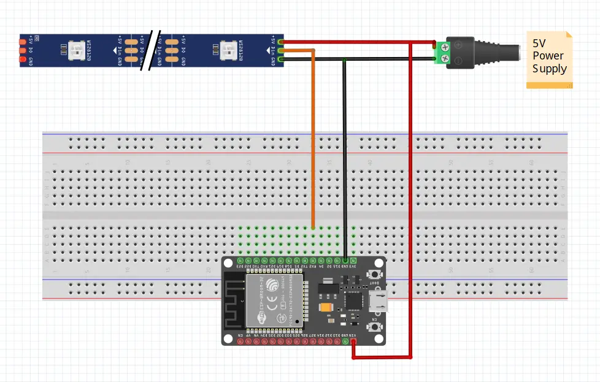

I know a ready-made LED controller is affordable. But I think ESP32 with WLED is more versatile and playable. I can integrate it into my Home Assistant and TV ambient light project later.

Let's get started.

## Video


## Parts Required
- 5M WS2812B 30LED/M LED Light Strip(Get any desire length).
- ESP 32(Any ESP8266/ESP32).
- 5V6A Power Supply.
- DC Jack.
- Breadboard.
- Some Jumper Wires.

## Flash WLED
We will use the easy way, ESP Web Tools, to flash the WLED firmware into ESP32. However, it requires using Google Chrome/Microsoft Edge browser and serial driver for your development board.

Go to [Install WLED](https://install.wled.me/) page, select the latest version, and click the Install button.

Select the ESP32's series port.

Click Install WLED

We can continue wiring up other parts.

After the installation, set up the Wi-Fi connection and log on to the WLED web UI.

Now, we can continue wiring up other parts.

## Wire-up

| WS2812B    | ESP32       | DC Jack |
| ---------- | ----------- | ------- |
| RX2(GPI16) | RX2(GPIO16) | 
| +5V        | VIN         | +       |
| GND        | GND         | -       |

The WS2812B has two ways to power it; one from the red and white wires or the 3-pin connector. The Power supply plug with the DC jack connects to the WS2812B's red(+) and white(GND) wires. 

ESP32's VIN, RX2(GPIO16), and GND connect with the WS2812B's 3-pin connector.

It's a common recommendation to put a 100 ~ 1000uF capacitor close to the WS2812B's +5V and GND pins. Also, a 220 ~ 470 Ω resistor is added near the WS2812B's data pin. Both addon for protection and signal stability purposes.

## Result

WS2812B in blends effect with Analogous color palette controlled by ESP32 and WLED