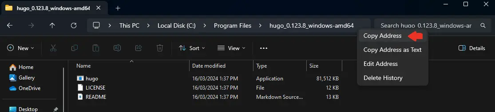
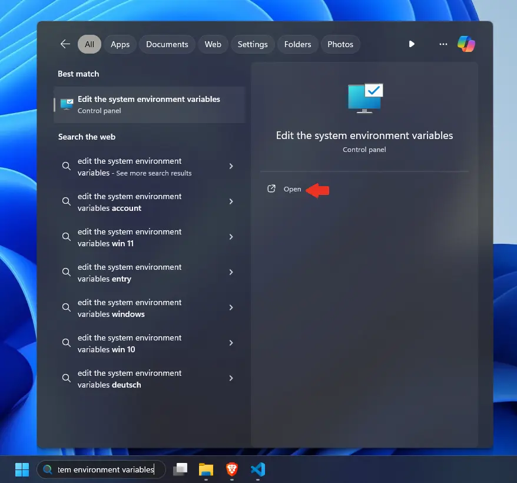
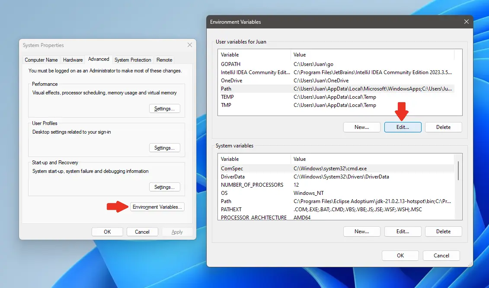
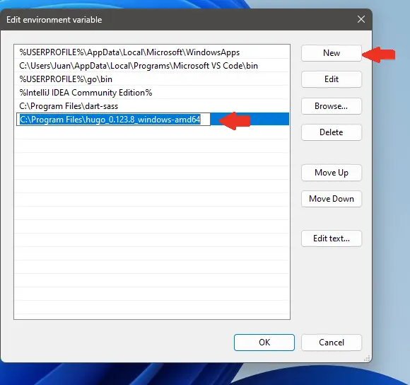

I recently switched from macOS(Hackintosh) to Windows 11. So, a lot of things need to be installed again. Hugo is one of the tools that I use to preview my blog posts or edit some theme settings.

To install the Hugo extended edition, we will only install Go/Golang and Git.

Let's install it.

## Install Go/Golang

Download the Go/Golang installer from the Go [website](https://go.dev/dl/).

Run it and proceed until complete.

To check the installation by executing the command below:
```shell
> go version
```

The result should be something like this:
```shell
go version go1.22.1 windows/amd64
```

## Install Git

Download the Git installer from the [official website](https://git-scm.com/download/win).

Run it and proceed until complete. Most of the settings are default, I only change the text editor to Visual Studio Code.

Afterward, we open the terminal to verify the installation as below:
```shell
> git --version
```

The result should be something like this:
```shell
git version 2.44.0.windows.1
```

## Install Hugo
Download the Hugo extended edition binary from Hugo's GitHub [repository](https://github.com/gohugoio/hugo/releases).




Extract the binary's compressed file. I take a further step to place it in the Program Files, Disk C, and copy the folder path.



Press the Win key, search "Edit the system environment variables", and press Open.



Click the Environment Variables button, select Path, and click the edit button in the User Variables section.



Click the New button and paste the Hugo extended edition binary's folder path.

Click the OK button twice to save the changes.

Open the terminal and execute this command to verify the installation.

```shell
> hugo version
```

The result should be something like this:
```shell
hugo v0.123.8-5fed9c591b694f314e5939548e11cc3dcb79a79c windows/amd64 BuildDate=2024-03-07T13:14:42Z VendorInfo=gohugoio
```


