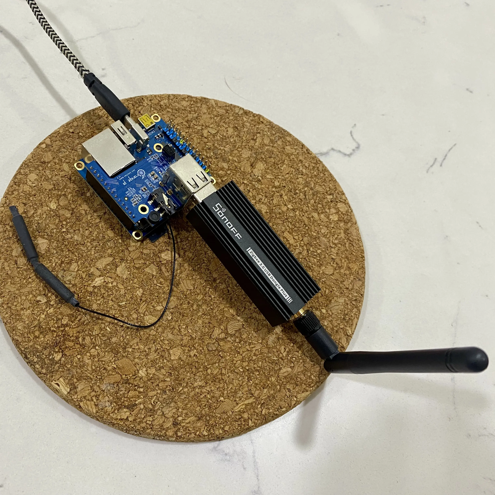

Recently, I bought the SONOFF Zigbee 3.0 USB Dongle Plus-P with a great deal. It was RM 84.95 and dropped to RM 64.84. 

At first, I don't plan to use it. I don't have a Zigbee device. Somehow, my newly brought SONOFF SwitchMan M5 smart switch has an issue with my outlet's neutral wire. [The ELCB trips immediately after I switch on the outlet's circuit breaker.](https://yjchoo.github.io/blog/posts/install-smart-switch-cause-elcb-trip/) To make my life easier, I replace it with a Smaturl Zigbee Smart Switch. Now, I can use it as a Zigbee hub/coordinator and integrate it into Home Assistant. 

My Home Assistant runs in Docker container using Docker Compose on Debian, so I will integrate my Zigbee dongle in the Docker Compose way.

Let's begin.

## Plug and Mount Zigbee Dongle into Docker Container


The first step is to plug the SONOFF Zigbee 3.0 USB Dongle Plus-P in the computer.

After, we execute the command in the terminal to find the Zigbee dongle's device path as below: 

```shell
$ sudo ls -la /dev/serial/by-id
```

For my case, we can see that the Zigbee dongle path is `/dev/ttyUSB0`.

```shell {linenos=inline, hl_lines=[4]}
total 0
drwxr-xr-x 2 root root 60 Jan 24 09:16 .
drwxr-xr-x 4 root root 80 Jan 24 09:16 ..
lrwxrwxrwx 1 root root 13 Jan 24 09:16 usb-ITead_Sonoff_Zigbee_3.0_USB_Dongle_Plus_f0e49294f6bded11bda96c2e38a92db5-if00-port0 -> ../../ttyUSB0
```

Then, we modify the docker-compose.yaml to mount the `/dev/ttyUSB0` into the Docker container as highlighted below:

```yaml {linenos=inline,hl_lines=[10,11]}
version: "3"
services:
  homeassistant:
    container_name: homeassistant
    image: "ghcr.io/home-assistant/home-assistant:stable"
    volumes:
      - ./config/homeassistant:/config
      - /etc/localtime:/etc/localtime:ro
      - /run/dbus:/run/dbus:ro
    devices:
      - /dev/ttyUSB0:/dev/ttyUSB0
    restart: unless-stopped
    privileged: true
    network_mode: host
```
We restart the Docker container for changes to take effect.
```shell
$ docker compose restart
```

Just in case, restart doesn't work. Do a clean restart as command below:
```shell
$ docker compose down
```

```shell
$ docker compose up -d
```

## Integrate Zigbee Dongle in Home Assistant

Next, configure the Zigbee dongle in Home Assistant according to below:

1. Go to __*Settings*__.
2. Click the __*ADD INTEGRATION*__ button.
3. Search __*Zigbee Home Automation*__ and select it twice. 
4. Select the Zigbee dongle's device path(__*/dev/ttyUSB0*__).
5. Select __*Create a new network*__ for network formation.
6. Done

## Paring Zigbee devices
Now, we can pair our Zigbee devices according to the manufacturer's instructions.

For my Smatrul Zigbee Switch, long press any button until the LED indicator light blinks to enter paring mode.

Afterward, we go back to the Home Assistant following below:

1. Go to __*Settings*__.
2. Click the __*ADD INTEGRATION*__ button.
3. Search and select __*Add Zigbee Device*__.
4. Devices should be discovered in the page.

## Conclude
The whole integration is more straightforward than I think. Home Assistant already has the integration of ZHA(Zigbee Home Automation) and is compatible with the chips used in SONOFF Zigbee 3.0 USB Dongle Plus-P, making the whole process just a few clicks. The little tricky part is the Zigbee dongle mounting to the Docker container. It needs a little digging for the Zigbee dongle’s device path. That’s it.