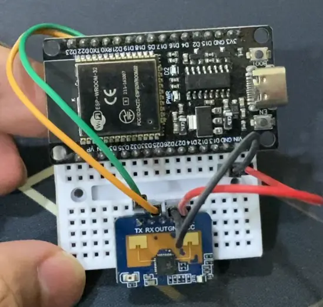
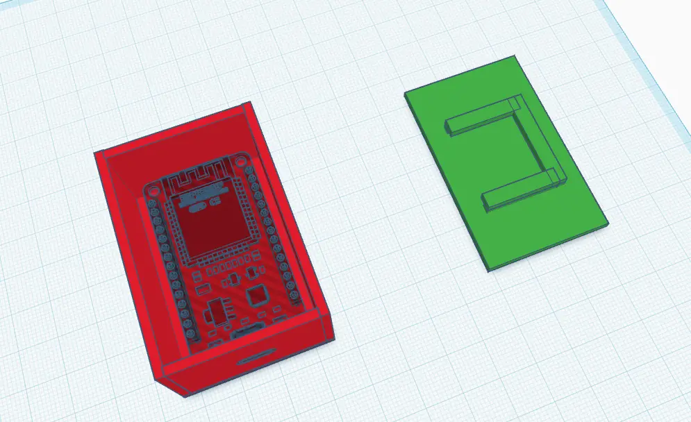
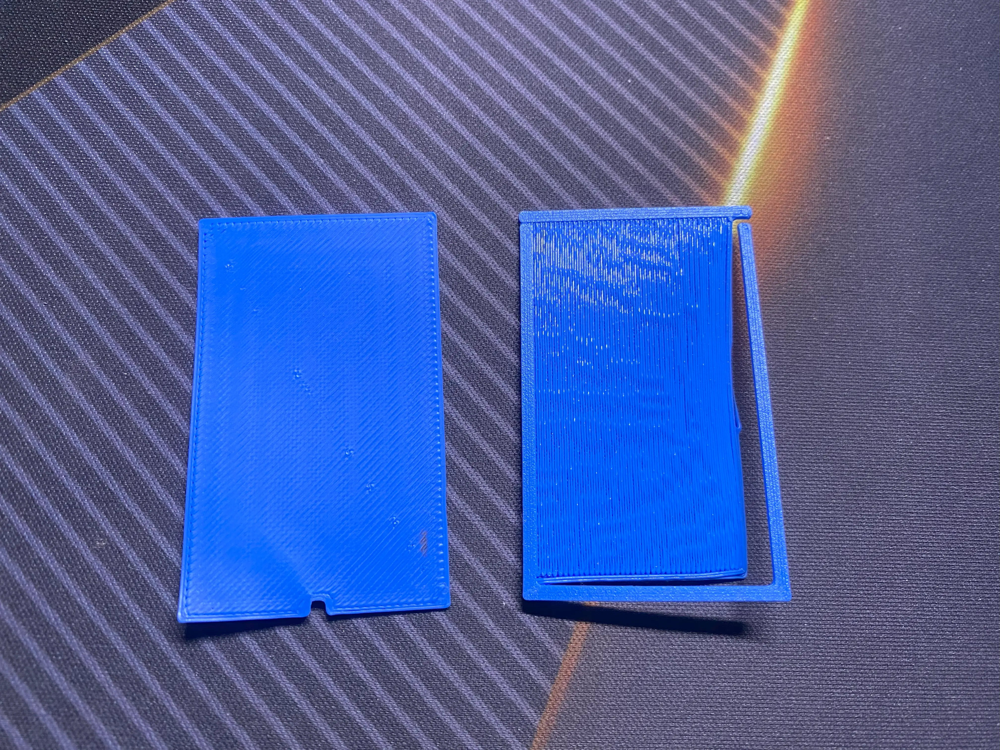
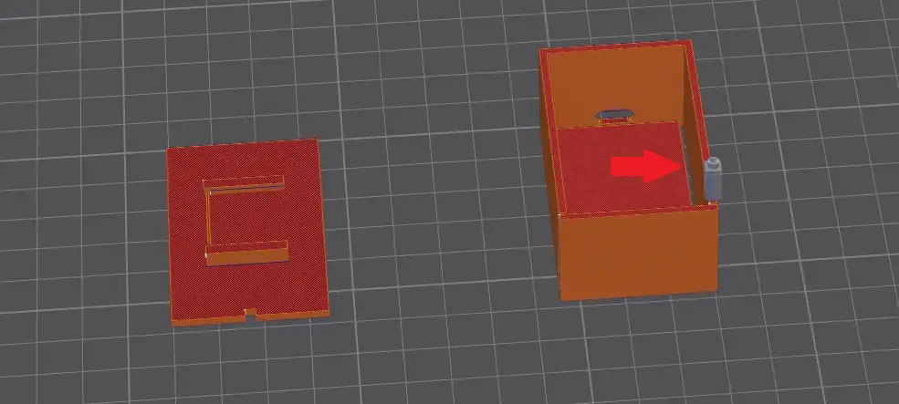
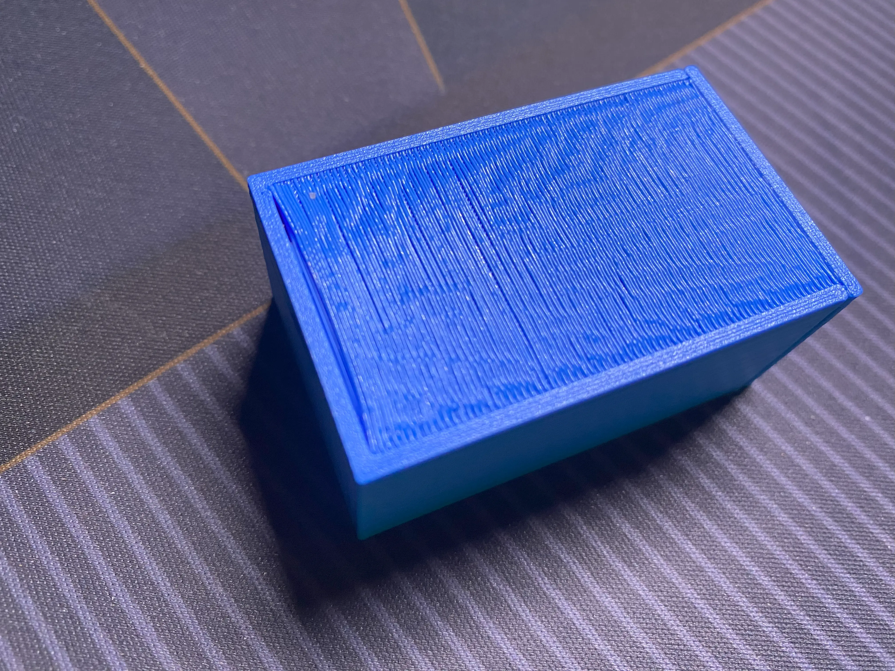
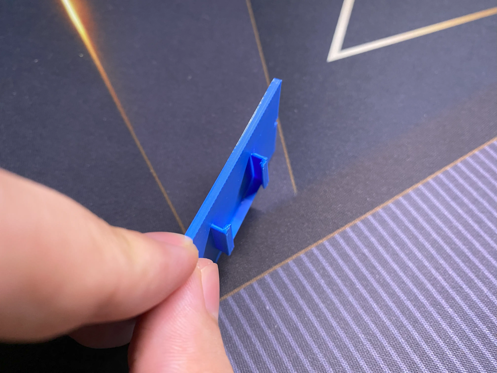
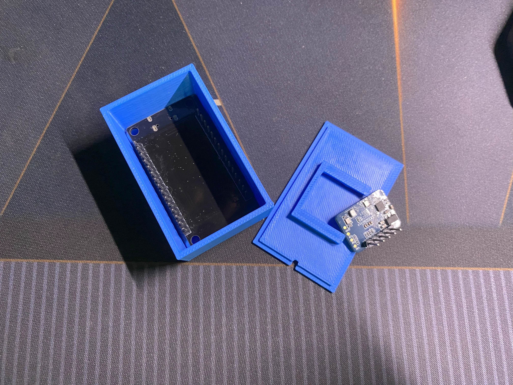
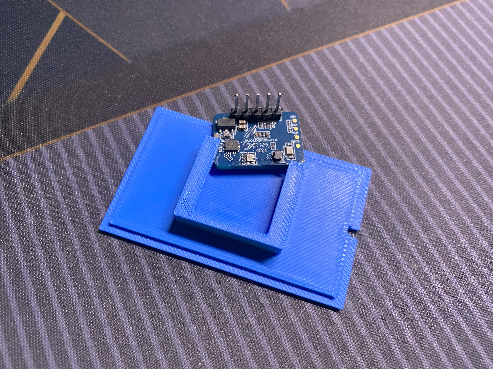
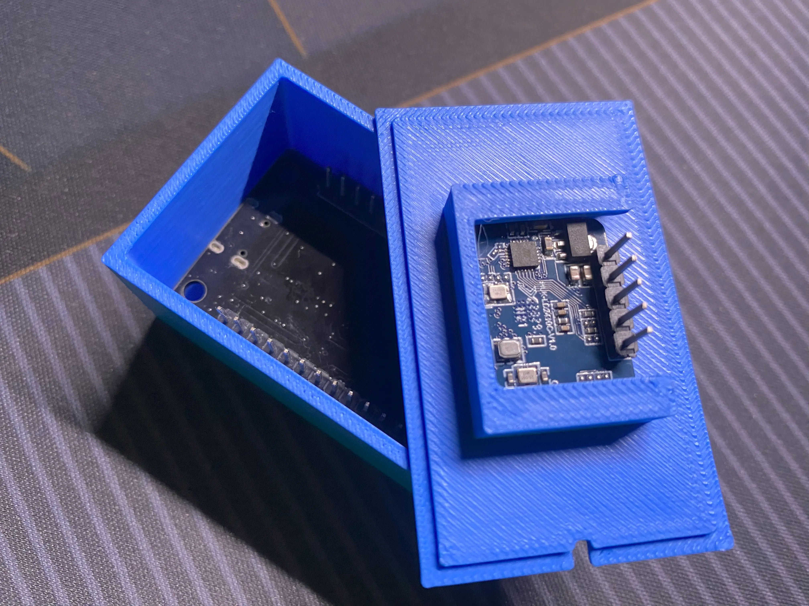
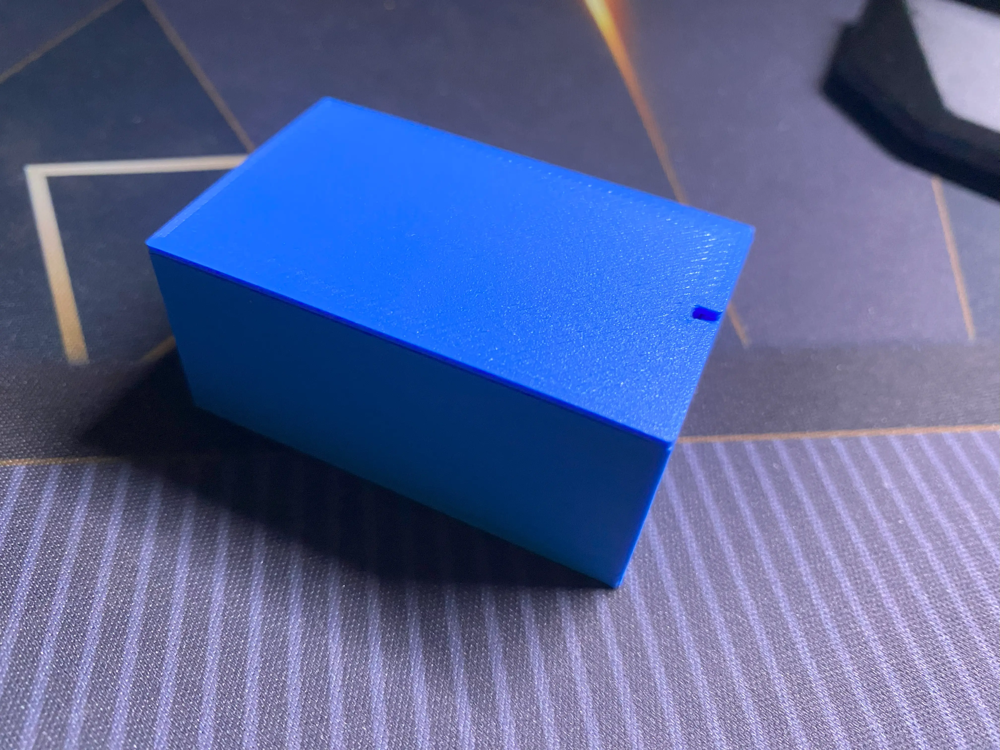

Since I got my first 3D printer, I want to learn 3D design to make my own model to solve my own problem. 
I don't know how to start. I think I should start with something simple. Simple means easy, right?

I have a DIY human presence sensor using an ESP32 and LD2410C. It's in a very raw state. I want to make a simple case for it. So, I started with the most intuitive one, in my opinion, TinkerCAD. It looks like just dragging a few boxes around.

## Video


## Plan & Build the 3D Design
My plan is simple and straightforward.
The box will hold the ESP32 with a hole for the USB-C port, and the lid will hold the LD2410.

To build it:
- I drag four walls to form a square, then add a wall to the bottom to make it a box.  
- I use an [ESP32 Devkit V1 USB-C model by Flametech6](https://www.tinkercad.com/things/2czhE3tLv53-esp32-devkit-v1-usb-c-vision) to mock up the USB-C position, and a [USB-C cutout model by lowerclasswarfare](https://www.tinkercad.com/things/5EdmwRANlsW-usb-c-cutout) to make the hole.
The hole is there to hold the ESP32 in position.
- I take the LD2410 measurements and make a U-shaped bracket to hold the sensor on the lid.

I export and start printing it. Just a few layers in, I stop immediately. 

Why is there a gap? 

I check the model... Yup, my bad. I was a bit careless there.

## Fixing the 3D Design Flaw

I fixed it up a bit, but the second attempt was still terrible.  The base of the box has a gap,  the walls aren't connecting properly, and one side of the U-shaped bracket on the lid is just floating. I broke it when I removed it from the 3D printer bed. Also, the lid has no way to snap onto the box.

Therefore, I restructured the 3D model. Instead of building everything by dragging solid shapes one by one, I started using the hole shape function to carve out the model and group them together. This way, I can avoid the wall connection issues. I also added an interference fit, also known as a friction fit, to the lid, hoping it can snap onto the box more securely.

On the first attempt with the new structure, the box looks good. The ESP32 fits in, and the USB-C cutout is spot on. But the lid? Not great. The U-shaped bracket is too narrow, and the lid can’t push into the box.

For the second attempt, I only printed the lid, since the box is fine. But still... it didn’t fit. 

I adjusted and tried a third time. Finally, it fits\!

It’s obviously not the best model, but it’s usable. I added a hole in the lid, thinking it’d help me pry the lid off. But turns out, it’s not even needed. I can just pry it from the side.

## Future Update for the 3D Model
I probably should’ve added some vents, for heat to escape. I think I’ll make a better version later. For now, this one will sit on my desk.

This won’t be the final form. I want it to hang on the wall. But I don’t know how to make a mount that can adjust angles or rotate. If you have any ideas or resources, drop them in the comments.  