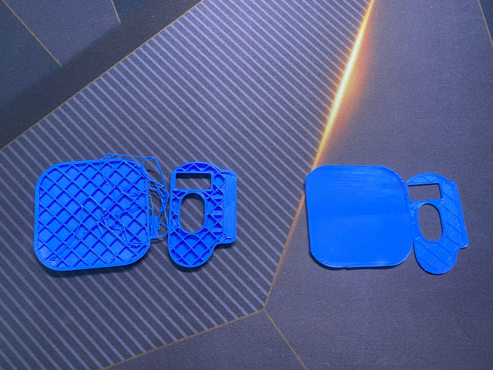
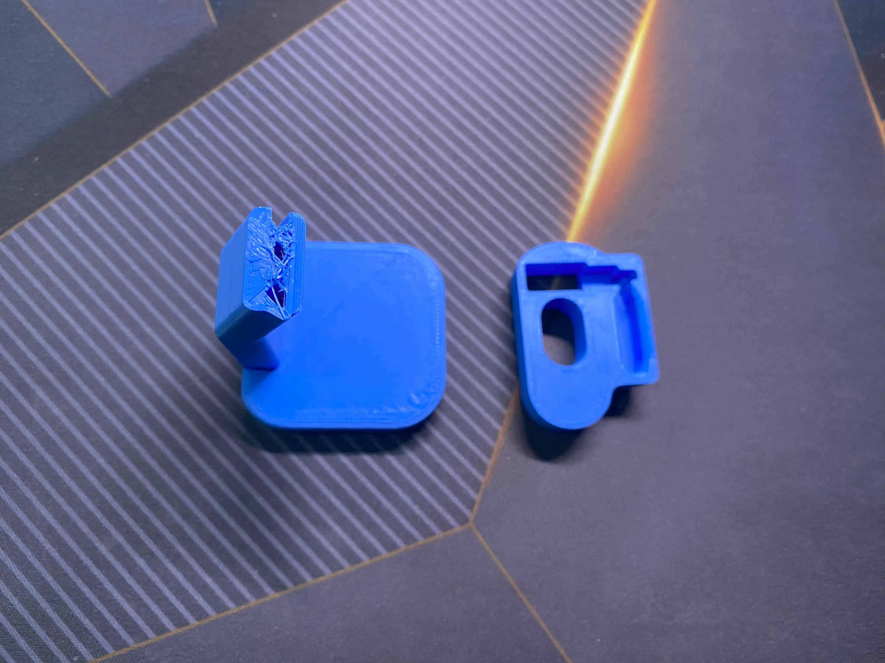
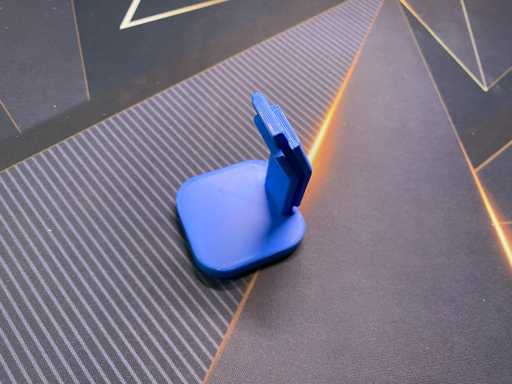
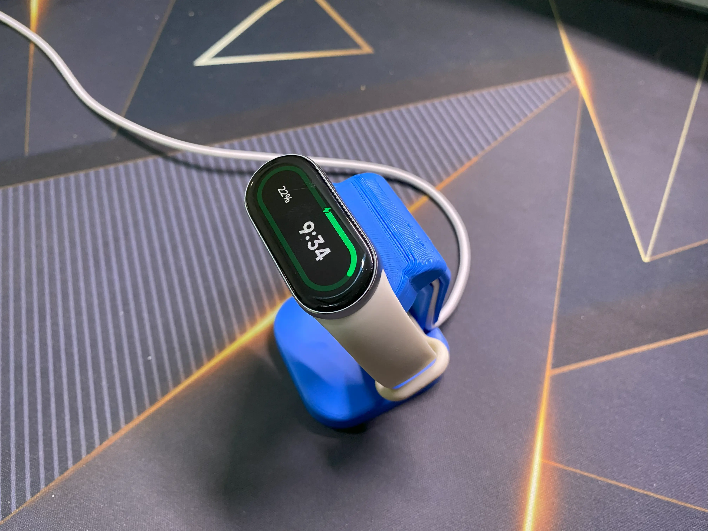

Recently, I got my first 3D printer, the Creality Hi.

I believe the usual first 3D print for a beginner should be the 3D Benchy. The printer itself even came preloaded with the model. But I chose to bite off more than I could chew by printing a **[Xiaomi Band 9 magnetic charging stand by benbryss](https://www.printables.com/model/1056340-mi-band-9-magnetic-charging-stand)**.

## YouTube Video


## 3 Failed 3D Printing Attempts

The first and second attempts had the same issue. One of the parts moved during printing. The model is split into 2 parts — I called them: stand and adapter. The stand part moved in the very beginning of the printing process. Luckily, I stopped it before it turned into spaghetti.

I googled the cause, and someone suggested that the bed plate might need cleaning. It's possible that fingerprints or body oil caused the adhesion issue. I think that’s highly possible — I did touch the bed plate a lot during the assembly. I wiped it with a clean microfibre cloth before the next attempt.

The third attempt was almost... almost!!! It almost completed the print. But the stand moved just a few minutes before it finished...... Let’s just think about the positive side — at least the adapter printed well.

At this point, I thought the problem might be the bed temperature.

This time, I started changing the settings in the slicer.

I'm quite certain I'm using Creality Ender series PLA filament. The slicer sets the bed temperature to 50°C after selecting that preset. I suspected the filament needed a higher bed temperature, so I switched the preset to generic PLA, which sets the bed temperature to 60°C.

I also checked the model page again. It turned out the creator shared some tips for better printing. I was just too excited and chose not to read it. My bad. I followed those settings this time.

I removed the adapter part, since it had already printed well. The final print went very smoothly. No more adhesion problems. I got a very solid print.

## Finally

Now I can snap the adapter and stand together and charge my Mi Band 9.
