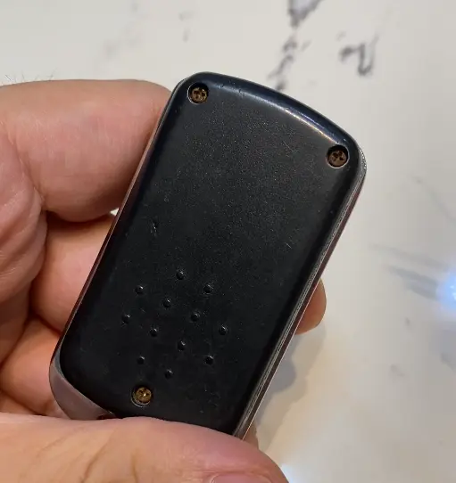
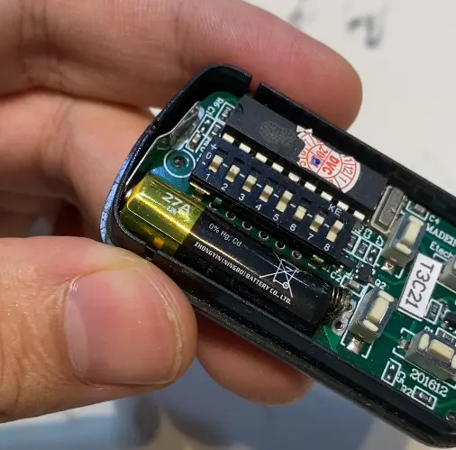
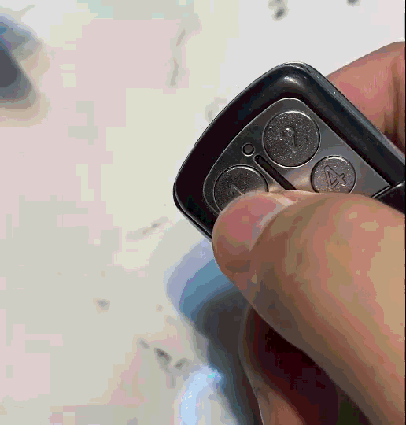

One day, I came back home from a grocery trip. I took out the auto gate remote control and pressed it, but nothing happened. I pressed again, and it still didn't work. 

That meant I needed to climb over the gate and press the wall button inside the house to open it. Luckily, my sister was at home. 

## YouTube Shorts 


## Sign of Battery is dying
My remote control has an indicator light. When I press the button, the light normally turns on and stay solid. However, my remote control is blinking now. 

I suspected the battery was failing and unable to provide enough voltage for the remote control to work properly. 

## Replace the Battery.
For my remote control, I needed to remove three screws at the back to access the inside. They are Phillips-head screws, which are very common and easy to find tools for. 

The remote control uses an A27/27A battery, which provides 12V. At first, I thought the 27A meant 27 amperes. Wow, that sounds like a very high current. However, A27/27A is just the battery type and does not refer to current. 

I got my A27/27A battery from a local hardware store, but I believe they are also sold in convenience and grocery stores. 

When replacing the battery, make sure the polarity is correct: positive to positive and negative to negative.

## Result
Put the cover, screws back on and done. 

