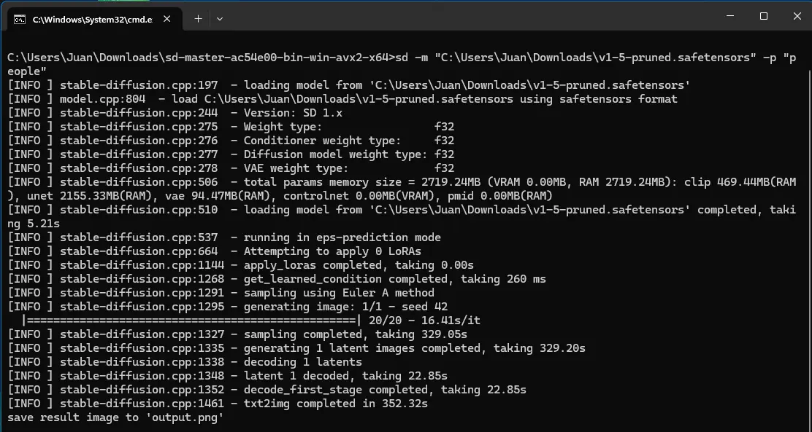

Let's start with my PC spec. 

| Components  | Parts                    |
| ----------- | ------------------------ |
| Processor   | Intel i5 10400ES         |
| iGPU        | `Intel UHD Graphics 630` |
| Motherboard | AsRock B460M Pro         |
| RAM         | Adata DDR4-2666 4GB x2   | 
| dGPU        | N/A                      |

When it comes to AI, most people probably think it requires a beefy GPU to run smoothly and quickly. 
And that's true. 
But just how bad will it be when running AI on a low-end GPU? 

## How to run LLM and Stable Diffusion on Intel UHD 630 iGPU? 
Intel has a Pytouch library called `IPEX-LLM` for running LLM on Intel CPU and GPU. 
However, it doesn’t seem to support my iGPU. 

The IPEX-LLM requires a graphic driver version of `31.0.101.5122` and higher, which is only compatible with Intel Core 11 gen and newer iGPUs, as well as Intel Arc GPUs. For the Intel UHD 630, the latest driver available is `31.0.101.2130`—below the required level. 

## LLM Test Run (Llama 3.2 1B Instruct Q8 Llama 3.2 3B Instruct Q8)

Let's run some Large Language Model(LLM). 
I used Jan, a software that support Vulkan, to run open LLMs. 
I will test run the `Llama 3.2 1B Instruct Q8` and `Llama 3.2 3B Instruct Q8`.

1. Download and install [Jan](https://jan.ai/).
2. Go the Settings &rarr; Advanced Settings &rarr; toggle Experimental Mode &rarr; toggle Vulkan Support.
3. Go the Hub, download `Llama 3.2 1B Instruct Q8` and `Llama 3.2 3B Instruct Q8`.
4. Then, we can start using these models.

### First Attempt on iGPU
I run the `Llama 3.2 1B Instruct Q8` on my iGPU and asked it, "List down what you can do for me". 

The iGPU utilization almost hit 100% while generating the response.

The token speed is around `7.7t/s`, which is fairly usable.

### Second Attempt on iGPU
Next, I switch the model to `Llama 3.2 3B Instruct Q8` and run it. 

`The model can't even start`—it failed to allocate memory due to `insufficient device memory`, as noted in the log.

The [Llama 3.2 3B Instruct Q8 require](https://llamaimodel.com/requirements-3-2/#3B) at least 8GB VRAM. My iGPU only got 4GB shared VRAM. Obviously, I don't have enough RAM to share with my iGPU.

### Third Attempt on CPU
Why not try the CPU instead? I toggle off the Vulkan support and run `Llama 3.2 1B Instruct Q8` on the `CPU`.

CPU utilization is between 80% and 90% during response generation.

WoW! The token speed is double up to `14.46t/s`, which is faster than the iGPU.

### Fourth Attempt on CPU
I continue try the Llama 3.2 3B Instruct Q8 on the CPU. This time, the model able to start and generate response.

CPU utilization close to 100% while generating response.

The token speed is about 5.56t/s, which is a bit slow but still usable.

## Stable Diffusion Test Run (SD 1.5)

To run Stable Diffusion on the iGPU, I use the `stable-diffusion.cpp` version that supports `Vulkan`.

### First Attempt on iGPU
I run the `Vulkan-supported stable-diffusion.cpp` executable with `Stable Diffusion 1.5 model` and using a `simple prompt, "people"`, with `default settings`. 

The iGPU utilization is around 100%.

It takes 551.46s(&thickapprox; 9 minutes and 11 seconds) to complete and the speed is 28.09s/it.

### Second Attempt on CPU - AVX2
I then download the `CPU AVX2-supported` stable-diffusion.cpp. I run it with `Stable Diffusion 1.5` model and a `simple prompt, "people"`. All the `settings remain default`.

The CPU utilization is around 66% only. 

It take 352.32s(&thickapprox; 5 minutes and 52 seconds) to complete with the speed of 16.41s/it.—nearly twice as fast as the iGPU.

## Conclusion

Thanks to Vulkan, I can play a little bit of AI things on my low-end iGPU.
However, when looking at token speed or iteration times, the CPU outperforms the iGPU by nearly double, which making almost no sense to use iGPU for AI tasks.

The only use case I can imagine is offload some of the workload from the CPU .
For example, if I'm coding and need a LLM to help debug, I could let the iGPU handle the LLM responses while the CPU focuses on compiling code.

Lastly, it's quite fun to play around AI.